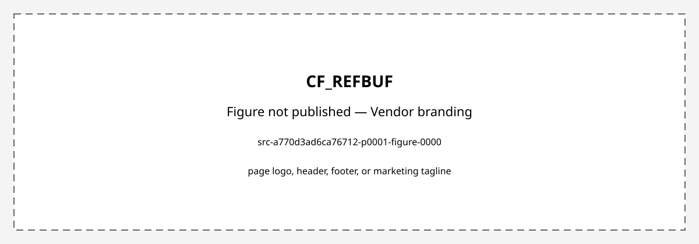

# CF_REFBUF

> **Draft for review.** Not a released spec. Figures are the original datasheet crops that passed branding review; any figure without a cached clearance was left out. Vendor wording may still be present in the text.

- Vendor block: `s8refbuf`
- Pages merged: 41/41
- Figures published: 1/2
- Skipped or invalid caches:
- (none)
- Figures not published:
- `src-a770d3ad6ca76712-p0001-figure-0000` — page logo, header, footer, or marketing tagline

---


> Precision Reference Buffer

## Overview

The block is a reference buffer used to drive different CapSense loads to the internal reference voltage. It supports three types of loads: light (10pf to 35pf), medium (110pf to 160pF), and very heavy (2nF to 30nF). It charges light loads in 165ns, medium loads in 800ns, and very heavy loads in 21us. The block is divided into a Mono-shot block for very heavy loads and a correction amplifier for all three modes, which includes a replica amplifier for light and medium loads. It has one top cell called s8refbuf_super_buf_psoc3 used in Leopard and Panther at IPS4 level, validated for Industrial temperature range (-40 to 100C). It drives light loads to 98.2% in 165ns, has a replica bias opamp for improved settling, an automatic turn-off mechanism for very heavy loads, 1V and 1.2V reference voltages, active mode current <450uA, amplifier on core supply (1.6V-2V), and output section on external supply (1.71-5.5V). The area is 18,200 um2. The block diagram shows a Mono-shot for very heavy loads, a correction amplifier for light and medium loads, and various components including a replica amplifier, current, drive mono-shot control, COMP, channel selection, and Vref signals.

A reference buffer block that can be configured for light, medium, and very heavy load modes, with charging times of 165ns for 35pF, 800ns for 160pF, and 21us for 30nF, an active current of 450uA, and support for enable/disable control via a power switch. The block routes its output directly to a pin using an analog global bus, with feedback closed at the chip level for monoshot mode, and it generates a trimmed reference voltage for driving external capacitors on pins. It supports Vref values of 1.0V and 1.2V and operates on a core supply of 1.6V to 1.95V and an external supply of 1.65V to 5.5V. The block is tested using DFT vectors and requires that feedback be taken from the pin to prevent IR drop.

This is the Table of Contents page for the 's8refbuf HardIP BLOCK REQUIREMENTS OBJECTIVE SPEC (BROS)' document, which is a specification for the s8refbuf block. It lists the sections and subsections of the document, including the purpose, scope, responsibilities, reference documents, and a critical requirements summary for the block. The document is from an Infineon Technologies company and is marked as confidential.

The document lists sections related to the s8refbuf HardIP block, including reset and initialization, power modes, interface to bus architectures, test modes, register definitions, trim information, power architecture, block derivative strategy, block behavioral model requirements, block integration requirements, technical specifications, and IP integration information.

This page contains a table of contents for the document, listing sections on noise analysis, silicon validation, production test plan, and appendices, with page numbers, and a footer stating the document is company confidential and a printed copy is uncontrolled, with a page number.

This document is a block requirements objective specification for the s8refbuf HardIP block, detailing tables related to block history, truth table, reference buffer voltages, boost drive selection, feedback channel selection, and PM schedule. The document is marked as confidential and uncontrolled in printed form.

This document specifies the requirements for the S8 reference buffer IP block s8refbuf, outlining the purpose, scope, and history of the block, including revisions and updates made to its design and documentation.

The s8refbuf block has a history of revisions including updates to the channel selector mux with a boost signal, the addition of native pass FETs to protect from high voltage on the reference input, a power switch on LV to reduce leakage, and updates for IP vault submission. It is referenced in block specifications and new product plans for PSoC3 Leopard and PSoC5 Panther.

Cypress Guardbanding Methodology Specification and CTAS and CTAC Methodology for the s8refbuf HardIP block

The evidence item provides a list of related memos and references for the s8refbuf block, indicating no entitlement, external standards, or third-party IP references. It specifies related memos including MAF-405, MFY-198, MFY-199, MFY-200, RKI-122, UMX-382, and UMX-387, all concerning s8refbuf in PSoC3 and related contexts.

A 1V/1.2V reference buffer that buffers a selected input reference to drive capacitive loads for cap-sensing algorithms, with a low settling time, and is tri-statable in nature, supporting light, medium, or very heavy loads.

A reference buffer block with a monoshot for large capacitive loads and a correction amplifier for fine-tuning output voltage to reference voltage.

The block drives reference voltages ref1 and ref2, operates in multiple modes including active, tristate, and suspend, with a strong driver for heavy loads, and supports channel selection between ch1 and ch2.

The block has no separate DFT pins. P substrate is connected to vnb, Nwell connections for the external supply domain are connected to vpbe, and for LV supply, Nwell is connected to vpb. The block uses two supplies: external supply (1.71 to 5.5V) called vpwre and core supply (1.6 to 2V) called vpwr, with a common ground (vgnd). The block also needs a boosted supply 'ng' which should be >3V, usually connected to the analog global pump. The block's I/O pins are described in the pin list. A timing diagram of the reference buffer is referenced.

The s8refbuf block provides an interface for the reference buffer, with inputs from the s8bg system and digital logic, and outputs to the Amux bus and GPIO. It supports light load mode and has no reset or initialization requirements.

The block has multiple load modes with specified settling times, tri-state and power down modes, and testing requirements for reference voltage and settling time.

The CF_REFBUF block, identified as s8refbuf_top, generates a reference voltage and includes a monoshot circuit for testing. The reference voltage can be 1.2 V or 1.0 V, and the block requires feedback via ch1/2 to operate. Testing involves connecting to analog global, enabling the buffer, and using Turbo mode to maintain monoshot operation.

The reference buffer block generates a trimmed reference voltage of 1.2 V or 1.0 V, connects to the analog global bus, and is enabled to output the reference voltage through a GPIO port.

The block uses two power supplies, vpwr and vpwre, and includes a power switch to reduce leakage current to less than 1nA during power down. It requires coaxial shielding for the reference signal when routed across switching signals and has specific integration guidelines for shielding. The block does not use registers or require trim, and a Verilog behavioral model is provided that models output with enable and power down logic but no start up behavior. The block is derived from Krypton design with changes including HV protection for reference inputs, a power switch for leakage reduction, and modified compensation caps.

This page describes constraints and requirements for the s8refbuf HardIP block, including placement, connection, and power requirements.

The s8refbuf block is a reference buffer with AC specifications focused on settling time for capsense applications, requiring 4 time constant settling (98.2% of final value), and additional parameters for 5 to 95% output transition.

A reference buffer block with requirements and integration details, including known integration targets and prerequisite IP.

The block was ported from S4 design (Quark) using the same specifications. No entitlement or alternatives study was conducted. Simulations are performed across corners, internal supply range of 1.6V to 1.95V, external supply range of 1.65V to 5.5V, and temperature range of -40°C to 150°C using asim in eldo. All final simulations use RC extracted view. ISB simulations set pd=1 (vpwre) and switchon=0 (vgnd), with output tristated. Floating node/DC path analysis uses nanosim. The block includes two opamps: replica opamp and correction opamp, with AC analysis for gain and phase margin, and transistors operating point checked. Simulations are run across PVT for stability analysis and functional simulation.

Simulations for verifying the functionality of the capsense driver for 1/1.2v reference inputs with core supply range 1.55v to 1.95v and external supply voltage 1.65 to 5.5v

The block is a reference buffer used in PSOC3 for power supply rejection ratio (PSRR) simulations, glitch simulations, settling time measurements, ISB simulations, suspend to active time simulations, and DFT simulations. Mismatch analysis was performed to estimate output offset voltage variation in the correction amplifier, noting that accuracy of the absolute output voltage is less critical compared to settling to the same level each time. Layout strategy includes interdigitized differential amplifiers for cancellation of vt variation with process and current mirrors with extra dummies for LOD matching.

The block has no FIB/Metop/programming elements, uses specific switches for physical verification, requires no ESD cells, and has no critical side area usage. It uses manual electromigration analysis, IR drop analysis, PSRR noise simulations, and output routing to GPIO via AMUX bus.

A block for a reference buffer with specified voltage and temperature conditions and characterization parameters.

The block's production test uses analog DFT vectors, with the tester (nextest) unable to control capacitive load and unable to measure settling time due to tight accuracy requirements (98.2%). The voltage measurement uses minimod with 0.4mV MGB. The current measurement MGB varies by range: 0 to 2uA (1nA, 10nA +.2% of value), 0 to 20uA (10nA, 50nA +.2% of value), 0 to 200uA (100nA, 500nA +.2% of value), 0 to 2mA (1uA, 5uA +.2% of value), 0 to 20mA (10uA, 50uA +.2% of value). MGB calculations for ranges are 14nA (0-2uA), 90nA (2-20uA), 900nA (20-200uA), 5600nA (200uA-2mA), 90uA (2mA-20mA). Currents measured are 100uA to 10mA. In correction amplifier mode, the main opamp settles the final voltage with the input driven to reference voltage and output screened. The block is only characterized for industrial temperature range, with automotive char to be done separately.

The evidence describes test modes and production test coverage for a reference buffer block, including monoshot mode and replica amplifier mode, which are used to test the reference voltage trip point by sweeping the output voltage and observing current reduction and polarity reversal at the trip point. Test vectors and limits are referenced in other documents.

The evidence describes a block named s8refbuf, which is a static hard IP for a capsense driver. It is used in the s8p-5r technology and is part of the leopard target product. The block type is static hard IP with no clock or data input. The block is associated with several deliverables including behavioral view, layout, symbol, schematic, extracted, abstract, lib_db_file, logic sims, circuit sims, floating filter file, and various physical verification checks. The block is named as s8refbuf_psoc3/s8refbuf_super_buf_psoc3 and is owned by mfy with program manager rgf and customer rep gls. The document is approved and was submitted on 12/16/2009.

The evidence lists several supporting documents related to the s8refbuf block, including characterization plans, design details, simulation results, and specification updates.

The evidence provides a project management schedule for a HardIP block, listing milestones, current schedule dates, cycle times, baseline cycle times, and deltas to baseline with reasons.

The evidence details the revision history of the s8refbuf HardIP block, listing ECN numbers, origins of change, and descriptions of changes including updates to specifications, document references, and internal configurations.

The evidence describes a worksheet for block documentation with general instructions and table structures for block information, pin lists, operating conditions, DC/AC specs, and test parameters. It includes instructions for filling out the tables with real data, unique identifiers, and specific fields for block area, pin details, operating conditions, specifications, and test information. The evidence does not provide specific details about the CF_REFBUF block itself but rather provides a template for documenting block information.

The reference buffer block provides a trimmed reference voltage. It is categorized as a static hard IP with no clock or data input, and is associated with the s8p-5r technology and PCIOS list 001-42632.

The block is a reference buffer with a specified size and area. The block size is 130*140 micrometers, and the block area is 18200 square micrometers for the public cell and some IPS versions, while other IPS versions have a block size of 123.225*147.695 micrometers and the same block area of 18200 square micrometers. The block is associated with the public name CF_REFBUF.

The block has a power down input, a 1.2V reference voltage input, an output that is tri-stateable, and control inputs for switching and boost mode.

The block is characterized by operating conditions for supply voltages, reference voltages, reference current, and temperature ranges.

The block provides a trimmed reference voltage with specified output levels and current characteristics under various conditions.

The block provides AC specifications for a reference buffer with performance metrics under various load conditions, voltage references, and temperature ranges, including settling times, rise times, glitch values, and power supply rejection ratios.

The block provides a reference buffer with trimmed reference voltage output, featuring multiple input and output pins for power, ground, bias, and control signals, operating under specific voltage and temperature conditions.

### Function

Drives different CapSense loads to the internal reference voltage.

The block generates a trimmed reference voltage for driving external capacitors on pins and operates in light, medium, and very heavy load modes with a monoshot mode that pumps current to charge the capacitor and turns off once the output reaches close to the reference.

The S8 reference buffer IP block s8refbuf is a reference buffer that provides a stable reference voltage for the system.

Buffers a selected input reference to drive capacitive loads for cap-sensing algorithms with a low settling time.

The block pre-charges large capacitive loads with high current and fine-tunes the output to the reference voltage.

It drives reference voltages ref1 and ref2 when enabled and tri-states the output in tristate or suspend modes, with a strong driver active in parallel for very heavy loads when boost is 1.

The block generates a trimmed reference voltage.

It interfaces with the s8bg system through REFMUX to receive Ref_1v2, and with digital logic to receive Boost, ch_cont, switchon, and pd, while providing an output to the Amux bus and GPIO connections for feedback in heavy loads.

The block buffers a reference voltage with specified settling times for different load conditions and supports tri-state and power down modes.

Generates a reference voltage of 1.2 V or 1.0 V and requires feedback via ch1/2 to operate. Testing involves connecting to analog global, enabling the buffer, and using Turbo mode to maintain monoshot operation.

The block generates a trimmed reference voltage of 1.2 V or 1.0 V and connects to the analog global bus to provide the reference voltage through a GPIO port.

This IP uses two power supplies, core supply vpwr and external supply vpwre, and includes a power switch to cut down the vpwr supply in power down so that typical ISB on vpwr supply is less than 1nA.

It provides a reference buffer with 4 time constant settling (98.2% of final value) required for capsense applications, and specifies additional parameters for time taken for output to reach 5 to 95% of final value.

A reference buffer block used for generating a trimmed reference voltage.

The block has two opamps: replica opamp and correction opamp, and performs AC analysis for gain and phase margin and checks transistors operating point.

The block generates a 1/1.2v reference voltage for capsense driver operation within a core supply range of 1.55v to 1.95v and external supply voltage of 1.65 to 5.5v

It provides a reference buffer for various simulation purposes including PSRR, glitch, settling time, ISB, suspend to active time, and DFT simulations, with the accuracy of the absolute output voltage being less critical compared to consistent settling to the same level each time.

The block is not to be used in the critical side area.

It measures the settling time, power supply rejection ratio (PSRR), and current (IDD) under specified voltage and temperature conditions.

The block is used for generating a reference voltage, with the main opamp settling the final voltage when in correction amplifier mode, and the input driven to the reference voltage, output screened for output.

enables large source current into the pin and observes current reduction and polarity reversal at the trip point when the output voltage is swept to cross the reference

The block generates a trimmed reference voltage for capsense driver applications.

It provides a trimmed reference voltage.

Generates a 1.2V reference voltage and provides a tri-statable output for reference buffer operations.

It operates under specified supply voltages, reference voltages, reference current, and temperature ranges.

The block generates a trimmed reference voltage and operates with specific settling times, rise times, and glitch characteristics under different load conditions and voltage references.

The block generates a trimmed reference voltage and buffers it for output, with control over its activation and connection to the load, and supports multiple reference voltage levels.

## Installation

Install the released package with IPM:

```bash
ipm install CF_REFBUF
```

Use the files under `hdl/gl/` as blackbox declarations, `layout/lef/` for physical integration, `layout/gds/` for the public abstract, and `timing/lib/` for available characterized views. The public GDS is an abstract; ChipFoundry substitutes protected full geometry during tapeout.

## Features

- Drives light loads ranging from 10pF to 35pF, settles to 98.2% in 165ns
- Drives medium loads ranging from 110pF to 160pF
- Replica bias opamp for light and medium modes for improved settling
- Drives very heavy loads ranging from 2nF to 30nF using the monoshot mode
- Automatic turn-off mechanism for very heavy loads to save power
- 1V and 1.2V reference voltages
- Active mode current <450uA
- Area is 18,200 um2
- Configurable for light, medium, and very heavy load modes
- Supports enable/disable control via a power switch
- Routed directly to a pin using an analog global bus
- Feedback closed at the chip level for monoshot mode
- Supports Vref values of 1.0V and 1.2V
- Operates on a core supply of 1.6V to 1.95V and an external supply of 1.65V to 5.5V
- The block must fulfill requirements set by the NPP Definition team for all target products.
- It must meet light load settling time specifications for stability.
- It supports various revisions and updates, including HVI layer inclusion for HV supply and DRC error clearance for new rules.
- It is designed to handle different configurations, such as using m3 shielded caps for routing with m4 over the cell in full chip for PSoC3/PSoC5.
- Charges the load to 1V/1.2V
- Tri-statable in nature
- Supports light, medium, or very heavy loads
- Monoshot block enabled for very large capacitive loads ranging from 2nf to 30nf
- Replica configuration used to charge the load capacitor close to the reference voltage
- Correction amplifier fine-tunes the output to the reference voltage and can discharge the initial voltage on the load
- It has a mode where switchon=1 and pd=0 to drive ref1/ref2 with the buffer active.
- It has a tristate mode when switchon=0 and pd=0 where the buffer output is tri-stated.
- It has a suspend mode when switchon=0 and pd=1 where the buffer is disabled and tri-stated.
- It supports a strong driver active in parallel when boost=1 to drive very heavy loads.
- It supports a strong driver disabled when boost=0 to drive normal, heavy loads.
- It selects ch1 as feedback channel when Ch_cont=1.
- It selects ch2 as feedback channel when Ch_cont=0.
- It has a requirement that during power up, the strong driver must be tri-stated by having a low on boost or switchon.
- Once enabled by boost=1, it turns itself off when output reaches the reference, and boost must be made 0 and then 1 to re-enable monoshot.
- P substrate connected to vnb
- Nwell connections for external supply domain connected to vpbe
- Nwell for LV supply connected to vpb
- Uses two supplies: external supply (1.71 to 5.5V) called vpwre and core supply (1.6 to 2V) called vpwr
- Common ground (vgnd)
- Requires a boosted supply 'ng' >3V, usually connected to the analog global pump
- I/O pins described in the pin list
- ch1 and ch2 are possible GPIO connections for feedback in heavy loads
- Ch_cont is the selection signal for either ch1 or ch2
- Boost, ch_cont, switchon, and pd come from digital logic
- Ref_1v2 comes from s8bg system through REFMUX
- Nbias comes from s8bg system
- Out connects to Amux bus
- switchoff is an output control signal
- no requirement of reset and initialization
- has light load mode
- It operates in multiple load modes with external load capacitance of 10pF to 35pF, 10pF to 60pF, and 2nF to 30nF, and has maximum settling times of 165ns, 800ns, and 21us respectively.
- It supports tri-state mode where the output is tri-stated.
- It supports power down mode where the total block is powered down and the output is tri-stated.
- It requires testing for reference voltage of 1.2 V or 1.0 V, with a settling time of less than 1us and an offset range of +/-15mV, and a test limit of +/-25mV.
- Supports reference voltage of 1.2 V or 1.0 V
- Requires feedback to buffer using ch1/2
- Enables reference buffer
- Applies voltage on pin to zero then enables Turbo mode (boost mode) for monoshot operation
- Monoshot will pull output to reference and turn off automatically based on feedback signal without forced zero output
- Supports 1.2 V and 1.0 V reference voltages
- Connects to analog global bus
- Enables reference voltage output through GPIO port
- No registers used inside the block
- No trim is required for this block
- Verilog behavioral model is provided with output modeled with enable and power down logic
- No start up behavior is modeled in the Verilog behavioral model
- 4 time constant settling (98.2% of final value) is required for capsense applications
- Additional parameters are added for time taken for output to reach 5 to 95% of final value which can be measured
- 1/1.2v reference inputs
- core supply range 1.55v to 1.95v
- external supply voltage 1.65 to 5.5v
- It is used for power supply rejection ratio (PSRR) simulations
- It is used for glitch simulations
- It is used for settling time measurements
- It is used for ISB simulations
- It is used for suspend to active time simulations
- It is used for DFT simulations
- Accuracy of the absolute output voltage is less critical compared to settling to same level each time in this application
- Output of the block can be routed to the GPIO though AMUX bus
- Bench char will be done across voltage and temperature
- Vpwre voltage range is 1.69 to 5.5V
- Vpwr voltage range is 1.6 to 1.95V
- Temperature range is -45, 25, 105
- Settling time measured from 5 to 95% of output voltage with external capacitance controlled to meet loading limits
- IDD measured by enabling and disabling the block to note difference in chip IDD
- DC PSRR measured on both internal and external supply by varying supply within limits and measuring variation in output voltage
- 15 devices characterized from production build devices across voltage and temperature
- The block supports industrial temperature range characterization only. Automotive characterization will be done as part of a separate NPP for leopard. Refer to MAF-405 for details.
- The block uses analog DFT vectors for production test, with the nextest tester used for voltage measurement using minimod with 0.4mV MGB.
- The block supports multiple current measurement ranges: 0 to 2uA (1nA resolution, 10nA +.2% of value accuracy), 0 to 20uA (10nA resolution, 50nA +.2% of value accuracy), 0 to 200uA (100nA resolution, 500nA +.2% of value accuracy), 0 to 2mA (1uA resolution, 5uA +.2% of value accuracy), 0 to 20mA (10uA resolution, 50uA +.2% of value accuracy).
- MGB calculations are 14nA for 0 to 2uA, 90nA for 2 to 20uA, 900nA for 20 to 200uA, 5600nA for 200uA to 2mA, and 90uA for 2mA to 20mA.
- Currents measured are of the order of 100uA to 10mA, with MGBs depending on the range setting for various measurements.
- In correction amplifier mode, the main opamp settles the final voltage, with the input voltage driven to the reference voltage and the output voltage screened for output.
- monoshot mode
- replica amplifier mode
- sweeping the output voltage to cross the reference
- observing current reduction and polarity reversal at the trip point
- has a power down input
- has a 1.2V reference voltage input
- has a tri-statable output
- has control inputs for switching and boost mode
- It supports a core supply voltage of 1.6 to 1.95 V
- It supports an external supply voltage of 1.65 to 5.5 V
- It supports a common ground of 0 V
- It supports input reference voltage of 1.01376 to 1.03424 V
- It supports input reference voltage of 1.188 to 1.212 V
- It supports input reference current of 9.12 to 10.08 uA
- It operates for a junction temperature of -40 to 100 C
- It operates for a junction temperature of -40 to 150 C for derated specifications
- The block produces an output voltage of 974 to 1074 mV at vref=1.024V
- The block produces an output voltage of 1140 to 1260 mV at vref=1.2V
- The block provides output current of 1.31 to 3.14 mA at 100mV output and vref=1V
- The block provides output current of 0.2 to 0.65 mA at 800mV output and vref=1V
- The block provides output current of -0.1 to -0.41 mA at 1200mV output and vref=1V
- The block provides output current of 2.46 to 7.23 mA at 100mV output and vref=1V
- The block provides output current of 2.16 to 6.56 mA at 800mV output and vref=1V
- Supports load ranges of 10 to 35 pF and 110 to 160 pF for standard operations
- Supports load ranges of 2 nF to 30 nF for boost mode operations
- Operates with reference voltages of 1.0 V and 1.2 V
- Supports temperature ranges including -40°C, 100°C, and 150°C
- Characterized for both industrial and automotive applications with specific conditions
- The block supports reference voltage inputs of 0.99 to 1.01 V and 1.188 to 1.212 V.
- The block has a power down input that disables the buffer when active high.
- The block has a functionality control bit that opens or closes the output switch to connect or disconnect the reference buffer from the load.
- The block has two feedback channels (ch1 and ch2) with a selection control to choose between them.
- The block provides a tri-statable output of the reference buffer.
- The block has an input for boosted voltage and a digital output for testing purposes.
- The block operates with core supply voltage between 1.55 and 1.95 V and external supply voltage between 1.65 and 5.5 V.
- The block operates within a junction temperature range of -40 to 100 C, and in some conditions up to 150 C.
- The block has settled operating current on vpwr up to 100 uA and on vpwre up to 800 uA.
- The block has tri-stated operating current on vpwr up to 50 uA and on vpwre up to 10 uA.
- The block has settling time of 0 to 99.8% for a 35 pF load up to 155 ns and for a 160 pF load up to 800 ns.
- The block has a suspend to active time up to 2 us.

### Architecture

- Divided into Mono-shot and correction amplifier
- Mono-shot block charges large capacitor to reference voltage in short duration and turns off automatically
- Correction amplifier used in all three modes to charge capacitor to accurate value
- Replica amplifier for light and medium loads which helps to charge capacitor initially with large current (less than monoshot mode)
- Charging time for light loads (35pF) is 165ns
- Charging time for medium loads (160pF) is 800ns
- Charging time for very heavy loads (30nF) is 21us
- Active current is 450uA
- Area is 18.2k um2
- The block includes a reference buffer with a specific circuit design to meet performance requirements.
- It has a top cell s8refbuf_super_buf_psoc3 for PSoC3/PSoC5 with opamps vpp caps using m3 shielded for routing with m4 over the cell in full chip.
- Consists of replica circuit, correction amplifier and mono-shot block
- Has 1 top cell - s8refbuf_super_buf_psoc3
- Monoshot block pre-charges the load with high current until the load voltage reaches the reference voltage, then the comparator trips and switches off the block
- Replica configuration charges the load capacitor close to the reference voltage
- Correction amplifier fine-tunes the output to the reference voltage
- It has reference voltages Vref1=1V and Vref2=1.2V.
- Ch1, Ch2, Ch_cont, Boost, Switchon, Pd, Ref_1v2, nbias, Switchoff, Out, and S8REFBUF_SUPER_BUF_PSOC3
- Block diagram of s8refbuf_top testing
- Current pulse generator
- s8refbuf_monoshot
- Ch_control
- Boost
- Bias
- PD
- Vpwre
- Vgnd
- monoshot_out
- hys_buff_bar
- S8refbuf_top
- Includes a current pulse generator and a mono-shot circuit
- Has a replica amplifier that forces large current through the analog global bus
- Power switch to cut down the vpwr supply in power down, so that typical ISB on vpwr supply is less than 1nA
- HV protection for reference inputs
- Power switch for LV supply for leakage reduction
- Change the compensation caps to ones with M3 shield for over the block routing
- The block has two opamps: replica opamp and correction opamp
- Differential amplifiers are laid out in interdigitized fashion for cancellation of vt variation with process
- Current mirrors are laid out with extra dummies for LOD matching
- NMOS decoupling cap substrates are connected to vgnd inside the block
- Rest of the ptap connections are to vnb
- Vgnd and vnb are expected to be shorted at chip level
- No DNWELL is used inside the IP to isolate the NMOS on the substrate
- Output voltage is discharged to zero before enabling the block to measure rise time
- PSRR calculated as 20*log(deltaVout/deltaVDD)
- The block size is 130*140 micrometers for the public cell and IPS1, IPS2, and the block size is 123.225*147.695 micrometers for IPS3 and IPS4
- The block area is 18200 square micrometers for all versions
- has a 1.2V reference voltage input labeled ref_1v2
- has a tri-statable output labeled out
- has a power down input labeled pd
- has a switchon input for connecting the reference buffer to the load
- has a switchoff output for testing
- has two feedback channels ch1 and ch2 from load to mono-shot block input
- has a ch_cont input for selecting between ch1 and ch2 feedback channels
- has a boost input for enabling strong drive in monoshot mode
- The block has power supply rejection of -38 to -48 dB on vpwr
- The block has power supply rejection of -60 to -64.13 dB on vpwre
- Settling time from 0 to 98.2% for load ranges 10 to 35 pF is 165 ns minimum
- Settling time from 0 to 98.2% for load ranges 110 to 160 pF is 800 ns minimum
- Rise time from 5% to 95% for load ranges 10 to 35 pF is 115 ns maximum
- Rise time from 5% to 95% for load ranges 110 to 160 pF is 450 ns maximum
- Glitch value for load ranges 10 to 35 pF is 12 mV maximum
- Glitch value for load ranges 110 to 160 pF is 5 mV maximum
- Suspend to active time is 2 μs maximum
- Settling time from 0 to 98.2% for boost mode with Vref = 1.0 V is 21 μs minimum
- Rise time from 5% to 95% for boost mode with load 2 nF to 30 nF is 19 μs maximum
- AC power supply rejection ratio (PSRR) on vpwr is -15 dB minimum
- AC power supply rejection ratio (PSRR) on vpwre is -15 dB minimum
- The block has a block size of 130*140 um or 123.225*147.695 um, and a block area of 18200 um2.
- The block includes multiple supply inputs for power, ground, and bulk voltages.
- The block includes analog and digital input and output pins for reference voltage, bias, and control signals.
- The block includes an analog output for the reference buffer and a digital output for testing.
- The block has a pin for input reference voltage of 1.0 V or 1.2 V.
- The block has a pin for input bias current ranging from 9.12 to 10.08 uA.
- The block has a pin for feedback channel selection to choose between ch1 and ch2.

### Variants

- Primary public cell: `CF_REFBUF`.

## Block Diagram

### Figure not published (vendor branding)



**Not published.** page logo, header, footer, or marketing tagline [src-a770d3ad6ca76712:p1]


## Pin Description

| Variant | Pin | Direction | Width | Active level | Domain | Description / constraints | Source |
|---|---|---|---:|---|---|---|---|
| All / unspecified | `vpwre` | power | 1 |  |  | Ext. Power supply | [src-a8a3c98ebe473a7e:p4] |
| All / unspecified | `vpwr` | power | 1 |  |  | Core Power supply | [src-a8a3c98ebe473a7e:p4] |
| All / unspecified | `vgnd` | ground | 1 |  |  | Ground supply | [src-a8a3c98ebe473a7e:p4] |
| All / unspecified | `vpbe` | power | 1 |  |  | P HV Bulk supply | [src-a8a3c98ebe473a7e:p4] |
| All / unspecified | `vpb` | power | 1 |  |  | P Bulk supply | [src-a8a3c98ebe473a7e:p4] |
| All / unspecified | `vnb` | power | 1 |  |  | N Bulk supply | [src-a8a3c98ebe473a7e:p4] |
| All / unspecified | `ng` | power | 1 |  |  | Boosted voltage | [src-a8a3c98ebe473a7e:p4] |
| All / unspecified | `pd` | power | 1 |  |  | Power down, Active  high.       0= Buffer Active                        1= Buffer disable | [src-a8a3c98ebe473a7e:p4] |
| All / unspecified | `ref_1v2` | power | 1 |  |  | 1v/1.2v Reference voltage | [src-a8a3c98ebe473a7e:p4] |
| All / unspecified | `nbias` | power | 1 |  |  | Input bias current (9.6uA +/-5%) | [src-a8a3c98ebe473a7e:p4] |
| All / unspecified | `switchon` | power | 1 |  |  | Functionality control bit  0= output switch open, refbuf disconnected from load 1= output switch closed. Refbuf connected to load. | [src-a8a3c98ebe473a7e:p4] |
| All / unspecified | `out` | power | 1 |  |  | Tri-statable output of reference buffer. | [src-a8a3c98ebe473a7e:p4] |
| All / unspecified | `switchoff` | power | 1 |  |  | Functionality control bit for testing purpose | [src-a8a3c98ebe473a7e:p4] |
| All / unspecified | `ch1` | power | 1 |  |  | Feedback channel from load to mono-shot block input. | [src-a8a3c98ebe473a7e:p4] |
| All / unspecified | `ch2` | power | 1 |  |  | Feedback channel from load to mono-shot block input. | [src-a8a3c98ebe473a7e:p4] |
| All / unspecified | `ch_cont` | power | 1 |  |  | 1= selects ch1 0= selects ch2 | [src-a8a3c98ebe473a7e:p4] |
| All / unspecified | `boost` | power | 1 |  |  | Active high enable for strong drive (monoshot mode) | [src-a8a3c98ebe473a7e:p4] |

## Specifications

### Operating Condition

| Parameter | Symbol | Min | Typ | Max / Value | Unit | Conditions | Source |
|---|---|---:|---:|---:|---|---|---|
| S8refbuf block |  |  |  | 10pF to 35pF, 110pF to 160pF, 2nF to 30nF |  |  | [src-a770d3ad6ca76712] |
| Vref |  |  |  | 1.2 V /1.0 V |  |  | [src-a770d3ad6ca76712] |
| Vpwr |  |  |  | Vpwr |  |  | [src-a770d3ad6ca76712] |
| Vgnd |  |  |  | Vgnd |  |  | [src-a770d3ad6ca76712] |
| Vpwre |  |  |  | Vpwre |  |  | [src-a770d3ad6ca76712] |
| AG Bus |  |  |  | AG Bus |  |  | [src-a770d3ad6ca76712] |
| monoshot_out |  |  |  | monoshot_out |  |  | [src-a770d3ad6ca76712] |
| hys_buff_bar |  |  |  | hys_buff_bar |  |  | [src-a770d3ad6ca76712] |
| ref_1v2 |  |  |  | ref_1v2 |  |  | [src-a770d3ad6ca76712] |
| Boost |  |  |  | Boost |  |  | [src-a770d3ad6ca76712] |
| Ch_control |  |  |  | Ch_control |  |  | [src-a770d3ad6ca76712] |
| Swon |  |  |  | Swon |  |  | [src-a770d3ad6ca76712] |
| Bias |  |  |  | Bias |  |  | [src-a770d3ad6ca76712] |
| PD |  |  |  | PD |  |  | [src-a770d3ad6ca76712] |
| GPIO |  |  |  | GPIO |  |  | [src-a770d3ad6ca76712] |
| Temperature |  | -45 |  | 105 | °C |  | [src-a770d3ad6ca76712] |
| Tj |  | -40 |  | 100 | C |  | [src-a8a3c98ebe473a7e] |
| Vref1 |  | 1.01376 |  | 1.03424 | V |  | [src-a8a3c98ebe473a7e] |
| Vref2 |  | 1.188 |  | 1.212 | V |  | [src-a8a3c98ebe473a7e] |
| iref |  | 9.12 |  | 10.08 | uA |  | [src-a8a3c98ebe473a7e] |
| Tjauto1 |  | -40 |  | 150 | C |  | [src-a8a3c98ebe473a7e] |
| Vpwr |  | 1.55 |  | 1.95 | V | 1.55 to 1.95 | [src-a8a3c98ebe473a7e:p8] |
| Vpwre |  | 1.65 |  | 5.5 | V | 1.65 to 5.5 | [src-a8a3c98ebe473a7e:p8] |
| Vgnd |  | 0 |  | 0 | V | 0 to 0 | [src-a8a3c98ebe473a7e:p8] |
| Tj |  | -40 |  | 100 | C | -40 to 100 | [src-a8a3c98ebe473a7e:p8] |
| Vref1 |  | 0.99 |  | 1.01 | V | 0.99 to 1.01 | [src-a8a3c98ebe473a7e:p8] |
| Vref2 |  | 1.188 |  | 1.212 | V | 1.188 to 1.212 | [src-a8a3c98ebe473a7e:p8] |
| iref |  | 9.12 |  | 10.08 | uA | 9.12 to 10.08 | [src-a8a3c98ebe473a7e:p8] |
| Tjauto1 |  | -40 |  | 150 | C | -40 to 150 | [src-a8a3c98ebe473a7e:p8] |

### Physical

| Parameter | Symbol | Min | Typ | Max / Value | Unit | Conditions | Source |
|---|---|---:|---:|---:|---|---|---|
| Area |  |  |  | 18.2k um2 | um2 |  | [src-a770d3ad6ca76712:p2] |
| external load |  | 10pF |  | 35pF |  |  | [src-a770d3ad6ca76712:p16] |
| internal capacitor |  |  |  | 100pF |  |  | [src-a770d3ad6ca76712:p16] |
| external capacitor |  | 10pF |  | 60pF |  |  | [src-a770d3ad6ca76712:p16] |
| very heavy load |  | 2nF |  | 30nF |  |  | [src-a770d3ad6ca76712:p16] |
| Technology |  |  |  | s8p-5r |  |  | [src-a770d3ad6ca76712] |
| Desc |  |  |  | capsense driver IP |  |  | [src-a770d3ad6ca76712] |
| DDC Type |  |  |  | hard |  |  | [src-a770d3ad6ca76712] |
| Target Product |  |  |  | leopard |  |  | [src-a770d3ad6ca76712] |
| Date Submited |  |  |  | 12/16/2009 22:07 |  |  | [src-a770d3ad6ca76712] |
| Date Modified |  |  |  | 12/16/2009 22:07 |  |  | [src-a770d3ad6ca76712] |
| Block Type |  |  |  | Static Hard IP (no clk/data in) |  |  | [src-a770d3ad6ca76712] |
| Behavioral View |  |  |  | Y |  |  | [src-a770d3ad6ca76712] |
| Layout |  |  |  | Y |  |  | [src-a770d3ad6ca76712] |
| Symbol |  |  |  | Y |  |  | [src-a770d3ad6ca76712] |
| Schematic |  |  |  | Y |  |  | [src-a770d3ad6ca76712] |
| Extracted |  |  |  | Y |  |  | [src-a770d3ad6ca76712] |
| Abstract |  |  |  | Y |  |  | [src-a770d3ad6ca76712] |
| lib db File |  |  |  | Y |  |  | [src-a770d3ad6ca76712] |
| Logic Sims |  |  |  | Y |  |  | [src-a770d3ad6ca76712] |
| Circuit Sims |  |  |  | Y |  |  | [src-a770d3ad6ca76712] |
| Floating Filter File |  |  |  | Y |  |  | [src-a770d3ad6ca76712] |
| cel fram w/ Antenna |  |  |  | Y |  |  | [src-a770d3ad6ca76712] |
| conn csf |  |  |  | Y |  |  | [src-a770d3ad6ca76712] |
| GateOxideSims SOA |  |  |  | Y |  |  | [src-a770d3ad6ca76712] |
| PV DRC |  |  |  | Y |  |  | [src-a770d3ad6ca76712] |
| PV Cldrc |  |  |  | Y |  |  | [src-a770d3ad6ca76712] |
| PV Stress |  |  |  | Y |  |  | [src-a770d3ad6ca76712] |
| PV Soft |  |  |  | Y |  |  | [src-a770d3ad6ca76712] |
| PV Latchup |  |  |  | Y |  |  | [src-a770d3ad6ca76712] |
| PV LVS |  |  |  | Y |  |  | [src-a770d3ad6ca76712] |
| HV LV MVV |  |  |  | Y |  |  | [src-a770d3ad6ca76712] |
| Block Size (um x um) |  |  |  | 130*140 |  |  | [src-a8a3c98ebe473a7e] |
| Block Size (um x um) |  |  | 130*140 |  | um x um | 130*140 | [src-a8a3c98ebe473a7e:p8] |
| Block Area (um2) |  |  | 18200 |  | um2 | 18200 | [src-a8a3c98ebe473a7e:p8] |

### Electrical

| Parameter | Symbol | Min | Typ | Max / Value | Unit | Conditions | Source |
|---|---|---:|---:|---:|---|---|---|
| Charging time for light loads (35pF) |  |  |  | 165ns | ns |  | [src-a770d3ad6ca76712:p2] |
| Charging time for medium loads (160pF) |  |  |  | 800ns | ns |  | [src-a770d3ad6ca76712:p2] |
| Charging time for very heavy loads (30nF) |  |  |  | 21us | us |  | [src-a770d3ad6ca76712:p2] |
| Active current |  |  |  | 450uA | uA |  | [src-a770d3ad6ca76712:p2] |
| VREF |  |  |  | 1V/1.2V |  |  | [src-a770d3ad6ca76712] |
| VDD |  |  |  | 1V/1.2V |  |  | [src-a770d3ad6ca76712] |
| VSS |  |  |  | 0V (implied) |  |  | [src-a770d3ad6ca76712] |
| Load capacitance |  |  |  | 2nF-30nF |  |  | [src-a770d3ad6ca76712] |
| Load resistance |  |  |  | 200 ohm |  |  | [src-a770d3ad6ca76712] |
| Inductance |  |  |  | 5nH |  |  | [src-a770d3ad6ca76712] |
| Capacitance |  |  |  | 100pF |  |  | [src-a770d3ad6ca76712] |
| Vref1 |  |  |  | 1V |  |  | [src-a770d3ad6ca76712] |
| Vref2 |  |  |  | 1.2V |  |  | [src-a770d3ad6ca76712] |
| reference voltage |  |  |  | 1.2 V /1.0 V |  |  | [src-a770d3ad6ca76712:p16] |
| offset |  | -15mV |  | 15mV |  |  | [src-a770d3ad6ca76712:p16] |
| Test limits |  | -25mV |  | 25mV |  |  | [src-a770d3ad6ca76712:p16] |
| ref_1v2 |  |  |  | must be co-axially shielded (Top and side) with analog ground if the signal is routed across switching signals. If routed in analog area, shielding by side is required. |  |  | [src-a770d3ad6ca76712] |

### Power

| Parameter | Symbol | Min | Typ | Max / Value | Unit | Conditions | Source |
|---|---|---:|---:|---:|---|---|---|
| vpwre |  | 1.71 |  | 5.5 |  |  | [src-a770d3ad6ca76712] |
| vpwr |  | 1.6 |  | 2 |  |  | [src-a770d3ad6ca76712] |
| vgnd |  |  |  | 0 |  |  | [src-a770d3ad6ca76712] |
| ng |  | >3 |  |  |  |  | [src-a770d3ad6ca76712] |
| vnb |  |  |  | N/A |  |  | [src-a770d3ad6ca76712] |
| vpbe |  |  |  | N/A |  |  | [src-a770d3ad6ca76712] |
| vpb |  |  |  | N/A |  |  | [src-a770d3ad6ca76712] |
| ISB |  |  |  | less than 1nA |  |  | [src-a770d3ad6ca76712] |
| IDD |  |  |  | difference in chip IDD |  |  | [src-a770d3ad6ca76712] |
| DC PSRR |  |  |  | 20*log(deltaVout/deltaVDD) |  |  | [src-a770d3ad6ca76712] |
| Is_vpwr |  | 100 |  |  | uA | fs, 1.65, 1.95, 100; Average supply current during settling  on vpwr (vref=1V) | [src-a8a3c98ebe473a7e] |

### Timing

| Parameter | Symbol | Min | Typ | Max / Value | Unit | Conditions | Source |
|---|---|---:|---:|---:|---|---|---|
| maximum settling time |  |  |  | 165ns |  |  | [src-a770d3ad6ca76712:p16] |
| settling time |  |  |  | 21us |  |  | [src-a770d3ad6ca76712:p16] |
| settling time required |  |  |  | <1us |  |  | [src-a770d3ad6ca76712:p16] |
| Tsl |  | 55.3 |  | 143.72 | ns | 0 to 99.8%, load=35pF | [src-a8a3c98ebe473a7e:p8] |
| Tsl |  | 580.33 |  |  | ns | 0 to 99.8%, load=160pF | [src-a8a3c98ebe473a7e:p8] |
| Tsl |  | 51.6 |  | 142.4 | ns | 0 to 99.8%, load=35pF, vref=1.2v | [src-a8a3c98ebe473a7e:p8] |
| Tsl |  | 580.69 |  |  | ns | 0 to 99.8%, load=160pF, vref=1.2v | [src-a8a3c98ebe473a7e:p8] |
| Tsl |  | 0.8 |  | 12.48 | us | 0 to 99.6%, Vref = 1.0v | [src-a8a3c98ebe473a7e:p8] |
| Tsl |  | 0.782 |  | 14.95 | us | 0 to 99.6%, Vref = 1.2v | [src-a8a3c98ebe473a7e:p8] |
| Glitch |  | -11.3 |  | 11.3 | mv | Load =10pF to 35pf | [src-a8a3c98ebe473a7e:p8] |
| Glitch |  | -3.43 |  | 1.61 | mv | Load =110pF to 160pF | [src-a8a3c98ebe473a7e:p8] |
| Glitch |  | -12.8 |  | 11.5 | mv | Load = 10pF to 35pF, vref=1.2v | [src-a8a3c98ebe473a7e:p8] |
| Glitch |  | -3.43 |  | 1.61 | mv | Load = 110pF to 160pF, vref=1.2v | [src-a8a3c98ebe473a7e:p8] |
| Tsa |  | 0.0739 |  | 0.3622 | us | Suspend to active time | [src-a8a3c98ebe473a7e:p8] |
| Tsa |  | 0.0739 |  | 0.483 | us | Suspend to active time, vref=1.2v | [src-a8a3c98ebe473a7e:p8] |

### Other

| Parameter | Symbol | Min | Typ | Max / Value | Unit | Conditions | Source |
|---|---|---:|---:|---:|---|---|---|
| Number of devices |  |  |  | 15 |  |  | [src-a770d3ad6ca76712] |
| 2MGB |  |  |  | 2MGB |  |  | [src-a770d3ad6ca76712] |
| Char silicon |  |  |  | etest data on char silicon |  |  | [src-a770d3ad6ca76712] |
| 15 devices |  |  |  | 15 devices of leopard ES3 are characterized on bench. |  |  | [src-a770d3ad6ca76712] |

### Accuracy

| Parameter | Symbol | Min | Typ | Max / Value | Unit | Conditions | Source |
|---|---|---:|---:|---:|---|---|---|
| MGB for voltage measurement |  |  |  | 0.4mV | mV |  | [src-a770d3ad6ca76712] |
| MGB for current measurement |  |  |  | 1nA | nA |  | [src-a770d3ad6ca76712] |
| MGB calculation for 0 to 2uA |  |  |  | 14nA | nA |  | [src-a770d3ad6ca76712] |
| MGB calculation for 2-20uA |  |  |  | 90nA | nA |  | [src-a770d3ad6ca76712] |
| MGB calculation for 20-200uA |  |  |  | 900nA | nA |  | [src-a770d3ad6ca76712] |
| MGB calculation for 200uA – 2mA |  |  |  | 5600nA | nA |  | [src-a770d3ad6ca76712] |
| MGB calculation for 2mA – 20mA |  |  |  | 90uA | uA |  | [src-a770d3ad6ca76712] |
| Tsl_low |  |  | 35.69 | 165 |  |  | [src-a8a3c98ebe473a7e] |
| Tsl_low_150C |  |  | 44.27 | 200 |  |  | [src-a8a3c98ebe473a7e] |
| Tsl_med |  |  | 256.55 | 800 |  |  | [src-a8a3c98ebe473a7e] |
| Trise_low |  |  | 23.91 | 115 |  |  | [src-a8a3c98ebe473a7e] |
| Trise_med |  |  | 171.73 | 450 |  |  | [src-a8a3c98ebe473a7e] |
| Glitch_low |  |  | -11.72 | 12 |  |  | [src-a8a3c98ebe473a7e] |
| Glitch_med |  |  | -3.09 | 5 |  |  | [src-a8a3c98ebe473a7e] |
| Tsa |  |  | 0.0172 | 2 |  |  | [src-a8a3c98ebe473a7e] |
| Tsl_low_1 |  |  | 34.54 | 165 |  |  | [src-a8a3c98ebe473a7e] |
| Tsl_low_1_150C |  |  | 46.45 | 200 |  |  | [src-a8a3c98ebe473a7e] |
| Tsl_med_1 |  |  | 242.74 | 800 |  |  | [src-a8a3c98ebe473a7e] |
| Trise_low_1 |  |  | 22.94 | 115 |  |  | [src-a8a3c98ebe473a7e] |
| Trise_med_1 |  |  | 165.9 | 450 |  |  | [src-a8a3c98ebe473a7e] |
| Glitch_low_1 |  |  | -13.02 | 12 |  |  | [src-a8a3c98ebe473a7e] |
| Glitch_med_1 |  |  | -3.31 | 5 |  |  | [src-a8a3c98ebe473a7e] |
| Tsa_1 |  |  | 0.0739 | 2 |  |  | [src-a8a3c98ebe473a7e] |
| Tsl_boost |  |  | 0.336 | 21 |  |  | [src-a8a3c98ebe473a7e] |
| Trise_boost |  |  | 0.254 | 19 |  |  | [src-a8a3c98ebe473a7e] |
| Tsl_boost_1 |  |  | 0.3948 | 21 |  |  | [src-a8a3c98ebe473a7e] |
| Trise_boost_1 |  |  | 0.308 | 19 |  |  | [src-a8a3c98ebe473a7e] |
| AC PSRR_vpwr |  |  | -20.53 | -15 |  |  | [src-a8a3c98ebe473a7e] |
| AC PSRR_vpwre |  |  | -23.87 | -15 |  |  | [src-a8a3c98ebe473a7e] |
| Is |  |  | 76.6 |  | uA | vref=1v | [src-a8a3c98ebe473a7e:p8] |
| Is |  |  | 79.16 |  | uA | vref=1.2V | [src-a8a3c98ebe473a7e:p8] |
| It |  |  | 37.39 |  | uA | vref=1v | [src-a8a3c98ebe473a7e:p8] |
| It |  |  | 36.89 |  | uA | vref=1.2V | [src-a8a3c98ebe473a7e:p8] |
| Isettle |  |  | 81.03 |  | uA | vref=1v | [src-a8a3c98ebe473a7e:p8] |
| Isettle |  |  | 83.2 |  | uA | vref=1.2V | [src-a8a3c98ebe473a7e:p8] |
| Leak, vpwr =1.8v, 1.95v |  | 238.7 |  | 319.05 | nA | leak.cor at temp=25 | [src-a8a3c98ebe473a7e:p8] |
| Leak, vpwr =1.8v, 1.95v |  | 4.378 |  | 4.919 | uA | leak.cor at temp=85 | [src-a8a3c98ebe473a7e:p8] |
| Leak, vpwre =3v, 5.5v |  | 1.214 |  | 11.61 | nA | leak.cor at temp=25 | [src-a8a3c98ebe473a7e:p8] |
| Leak, vpwre =3v, 5.5v |  | 19.6 |  | 38.62 | nA | leak.cor at temp=85 | [src-a8a3c98ebe473a7e:p8] |
| tt_leak,  vpwr    = 1.8v, 1.95v |  | 2.81 |  | 3.39 | nA | tt_leak.cor at temp=25 | [src-a8a3c98ebe473a7e:p8] |
| tt_leak, vpwre   = 3v, 5.5v |  | 0.495 |  | 3.32 | nA | tt_leak.cor at temp=25 | [src-a8a3c98ebe473a7e:p8] |

### Operating Modes and Sequences

#### Mono-shot

used in very heavy load applications. It charges large capacitor to the reference voltage in short duration and turns off automatically. [src-a770d3ad6ca76712]

**Entry conditions**
- None stated.

**Behavior**
- None stated.

**Exit conditions**
- None stated.

#### Correction amplifier

used in all three modes to charge the capacitor to the accurate value. It also has a replica amplifier for light and medium loads which helps to charge the capacitor initially with a large current (less than monoshot mode) [src-a770d3ad6ca76712]

**Entry conditions**
- None stated.

**Behavior**
- None stated.

**Exit conditions**
- None stated.

#### Replica bias opamp

for light and medium modes for improved settling [src-a770d3ad6ca76712]

**Entry conditions**
- None stated.

**Behavior**
- None stated.

**Exit conditions**
- None stated.

#### Monoshot mode

Drives very heavy loads ranging from 2nf to 30nF using the monoshot mode [src-a770d3ad6ca76712]

**Entry conditions**
- None stated.

**Behavior**
- None stated.

**Exit conditions**
- None stated.

#### Automatic turn-off mechanism

for very heavy loads, to save power. [src-a770d3ad6ca76712]

**Entry conditions**
- None stated.

**Behavior**
- None stated.

**Exit conditions**
- None stated.

#### 1V and 1.2V reference voltages

1V and 1.2V reference voltages. [src-a770d3ad6ca76712]

**Entry conditions**
- None stated.

**Behavior**
- None stated.

**Exit conditions**
- None stated.

#### Active mode current

Active mode current <450uA [src-a770d3ad6ca76712]

**Entry conditions**
- None stated.

**Behavior**
- None stated.

**Exit conditions**
- None stated.

#### Amplifier on core supply

Amplifier on core supply (1.6V-2V), output section on external supply (1.71-5.5V) [src-a770d3ad6ca76712]

**Entry conditions**
- None stated.

**Behavior**
- None stated.

**Exit conditions**
- None stated.

#### light/medium

This block can be configured light/medium and very heavy load mode. boost is used to configure the block into the very heavy load. Once the boost is enabled, monoshot pumps current to charge the cap. Once the output reaches close to reference, it turns itself off. Boost need to be pulsed low and high to re-enable the boost mode. [src-a770d3ad6ca76712:p2]

**Entry conditions**
- None stated.

**Behavior**
- None stated.

**Exit conditions**
- None stated.

#### 1.1 Purpose

Purpose [src-a770d3ad6ca76712]

**Entry conditions**
- None stated.

**Behavior**
- None stated.

**Exit conditions**
- None stated.

#### 1.2 Scope

Scope [src-a770d3ad6ca76712]

**Entry conditions**
- None stated.

**Behavior**
- None stated.

**Exit conditions**
- None stated.

#### 1.3 Block History

Block History [src-a770d3ad6ca76712]

**Entry conditions**
- None stated.

**Behavior**
- None stated.

**Exit conditions**
- None stated.

#### 2. RESPONSIBILITIES

RESPONSIBILITIES [src-a770d3ad6ca76712]

**Entry conditions**
- None stated.

**Behavior**
- None stated.

**Exit conditions**
- None stated.

#### 3. REFERENCE DOCUMENTS

REFERENCE DOCUMENTS [src-a770d3ad6ca76712]

**Entry conditions**
- None stated.

**Behavior**
- None stated.

**Exit conditions**
- None stated.

#### 3.1 Block Specs

Block Specs [src-a770d3ad6ca76712]

**Entry conditions**
- None stated.

**Behavior**
- None stated.

**Exit conditions**
- None stated.

#### 3.2 NPP Spec

NPP Spec [src-a770d3ad6ca76712]

**Entry conditions**
- None stated.

**Behavior**
- None stated.

**Exit conditions**
- None stated.

#### 3.3 Best Practices Specs

Best Practices Specs [src-a770d3ad6ca76712]

**Entry conditions**
- None stated.

**Behavior**
- None stated.

**Exit conditions**
- None stated.

#### 3.3.1 01-00240 - Circuit Design Best Practices

01-00240 - Circuit Design Best Practices [src-a770d3ad6ca76712]

**Entry conditions**
- None stated.

**Behavior**
- None stated.

**Exit conditions**
- None stated.

#### 3.3.2 01-00374 - Monte Carlo Simulation Best Practices

01-00374 - Monte Carlo Simulation Best Practices [src-a770d3ad6ca76712]

**Entry conditions**
- None stated.

**Behavior**
- None stated.

**Exit conditions**
- None stated.

#### 3.3.3 01-00392 - Power/Ground Noise Simulation Best Practices

01-00392 - Power/Ground Noise Simulation Best Practices [src-a770d3ad6ca76712]

**Entry conditions**
- None stated.

**Behavior**
- None stated.

**Exit conditions**
- None stated.

#### 3.4 Platform System Architecture Specs

Platform System Architecture Specs [src-a770d3ad6ca76712]

**Entry conditions**
- None stated.

**Behavior**
- None stated.

**Exit conditions**
- None stated.

#### 3.5 PCIOS

PCIOS [src-a770d3ad6ca76712]

**Entry conditions**
- None stated.

**Behavior**
- None stated.

**Exit conditions**
- None stated.

#### 3.6 IROS

IROS [src-a770d3ad6ca76712]

**Entry conditions**
- None stated.

**Behavior**
- None stated.

**Exit conditions**
- None stated.

#### 3.7 EROS

EROS [src-a770d3ad6ca76712]

**Entry conditions**
- None stated.

**Behavior**
- None stated.

**Exit conditions**
- None stated.

#### 3.8 PAS

PAS [src-a770d3ad6ca76712]

**Entry conditions**
- None stated.

**Behavior**
- None stated.

**Exit conditions**
- None stated.

#### 3.9 00-00064 - Cypress Record Retention Policy

00-00064 - Cypress Record Retention Policy [src-a770d3ad6ca76712]

**Entry conditions**
- None stated.

**Behavior**
- None stated.

**Exit conditions**
- None stated.

#### 3.10 01-00290 - IP Block Development Methodology

01-00290 - IP Block Development Methodology [src-a770d3ad6ca76712]

**Entry conditions**
- None stated.

**Behavior**
- None stated.

**Exit conditions**
- None stated.

#### 3.11 01-00292 - Cypress DFT Methodology

01-00292 - Cypress DFT Methodology [src-a770d3ad6ca76712]

**Entry conditions**
- None stated.

**Behavior**
- None stated.

**Exit conditions**
- None stated.

#### 3.12 01-01003 - IP Deliverables Methodology

01-01003 - IP Deliverables Methodology [src-a770d3ad6ca76712]

**Entry conditions**
- None stated.

**Behavior**
- None stated.

**Exit conditions**
- None stated.

#### 3.13 001-50713 - Cypress Design Naming Conventions

001-50713 - Cypress Design Naming Conventions [src-a770d3ad6ca76712]

**Entry conditions**
- None stated.

**Behavior**
- None stated.

**Exit conditions**
- None stated.

#### 3.14 001-42082 - CIC Best Practices

001-42082 - CIC Best Practices [src-a770d3ad6ca76712]

**Entry conditions**
- None stated.

**Behavior**
- None stated.

**Exit conditions**
- None stated.

#### 3.15 Hard/Firm IP (if applicable for this block)

Hard/Firm IP (if applicable for this block) [src-a770d3ad6ca76712]

**Entry conditions**
- None stated.

**Behavior**
- None stated.

**Exit conditions**
- None stated.

#### 16-00003 - Cypress Guardbanding Methodology Specification

16-00003 - Cypress Guardbanding Methodology Specification [src-a770d3ad6ca76712]

**Entry conditions**
- None stated.

**Behavior**
- None stated.

**Exit conditions**
- None stated.

#### 16-00073 - CTAS and CTAC Methodology

16-00073 - CTAS and CTAC Methodology [src-a770d3ad6ca76712]

**Entry conditions**
- None stated.

**Behavior**
- None stated.

**Exit conditions**
- None stated.

#### 3.16 Appropriate COE Specs

Appropriate COE Specs [src-a770d3ad6ca76712]

**Entry conditions**
- None stated.

**Behavior**
- None stated.

**Exit conditions**
- None stated.

#### 01-00410 - Design Centers of Excellence (Design COE)

01-00410 - Design Centers of Excellence (Design COE) [src-a770d3ad6ca76712]

**Entry conditions**
- None stated.

**Behavior**
- None stated.

**Exit conditions**
- None stated.

#### 3.16.1 Entitlement References

Entitlement References [src-a770d3ad6ca76712]

**Entry conditions**
- None stated.

**Behavior**
- None stated.

**Exit conditions**
- None stated.

#### 3.17 External Standards

External Standards [src-a770d3ad6ca76712]

**Entry conditions**
- None stated.

**Behavior**
- None stated.

**Exit conditions**
- None stated.

#### 3.18 Third Party IP References

Third Party IP References [src-a770d3ad6ca76712]

**Entry conditions**
- None stated.

**Behavior**
- None stated.

**Exit conditions**
- None stated.

#### 3.19 Related Memos

Related Memos [src-a770d3ad6ca76712]

**Entry conditions**
- None stated.

**Behavior**
- None stated.

**Exit conditions**
- None stated.

#### 4. HARD/FIRM IP: CRITICAL REQUIREMENTS SUMMARY

HARD/FIRM IP: CRITICAL REQUIREMENTS SUMMARY [src-a770d3ad6ca76712]

**Entry conditions**
- None stated.

**Behavior**
- None stated.

**Exit conditions**
- None stated.

#### 4.1 Overview of Block Applications

Overview of Block Applications [src-a770d3ad6ca76712]

**Entry conditions**
- None stated.

**Behavior**
- None stated.

**Exit conditions**
- None stated.

#### 4.2 Block Architecture Overview

Block Architecture Overview [src-a770d3ad6ca76712]

**Entry conditions**
- None stated.

**Behavior**
- None stated.

**Exit conditions**
- None stated.

#### 4.2.1 Block Description

Block Description [src-a770d3ad6ca76712]

**Entry conditions**
- None stated.

**Behavior**
- None stated.

**Exit conditions**
- None stated.

#### 4.2.2 Truth Tables

Truth Tables [src-a770d3ad6ca76712]

**Entry conditions**
- None stated.

**Behavior**
- None stated.

**Exit conditions**
- None stated.

#### 4.2.3 Block Pin List

Block Pin List [src-a770d3ad6ca76712]

**Entry conditions**
- None stated.

**Behavior**
- None stated.

**Exit conditions**
- None stated.

#### 4.2.3.1 DFT, BIST Pins

DFT, BIST Pins [src-a770d3ad6ca76712]

**Entry conditions**
- None stated.

**Behavior**
- None stated.

**Exit conditions**
- None stated.

#### 4.2.3.2 Bulk Pins

Bulk Pins [src-a770d3ad6ca76712]

**Entry conditions**
- None stated.

**Behavior**
- None stated.

**Exit conditions**
- None stated.

#### 4.2.3.3 Power Supply Pins

Power Supply Pins [src-a770d3ad6ca76712]

**Entry conditions**
- None stated.

**Behavior**
- None stated.

**Exit conditions**
- None stated.

#### 4.2.3.4 I/O Pins

I/O Pins [src-a770d3ad6ca76712]

**Entry conditions**
- None stated.

**Behavior**
- None stated.

**Exit conditions**
- None stated.

#### 4.2.4 Timing Requirements and Diagrams

Timing Requirements and Diagrams [src-a770d3ad6ca76712]

**Entry conditions**
- None stated.

**Behavior**
- None stated.

**Exit conditions**
- None stated.

#### 4.2.5 Block Level Interfaces

Block Level Interfaces [src-a770d3ad6ca76712]

**Entry conditions**
- None stated.

**Behavior**
- None stated.

**Exit conditions**
- None stated.

#### *F

Added native pass FETs to limit the voltage on Nshort input devices to protect from potential HV signal on reference input. [src-a770d3ad6ca76712]

**Entry conditions**
- None stated.

**Behavior**
- None stated.

**Exit conditions**
- None stated.

#### *G

Added power switch on LV to reduce leakage. Updated BROS to *X, re-wrote all sections for IP vault submission for leopard. [src-a770d3ad6ca76712]

**Entry conditions**
- None stated.

**Behavior**
- None stated.

**Exit conditions**
- None stated.

#### *H

Added pm schedule in Appendix 3 [src-a770d3ad6ca76712]

**Entry conditions**
- None stated.

**Behavior**
- None stated.

**Exit conditions**
- None stated.

#### *I

IPS4 schedule update. Updated schedule on PM system [src-a770d3ad6ca76712]

**Entry conditions**
- None stated.

**Behavior**
- None stated.

**Exit conditions**
- None stated.

#### *J

IPS4 updates [src-a770d3ad6ca76712]

**Entry conditions**
- None stated.

**Behavior**
- None stated.

**Exit conditions**
- None stated.

#### *K

Sunset review. No document update [src-a770d3ad6ca76712]

**Entry conditions**
- None stated.

**Behavior**
- None stated.

**Exit conditions**
- None stated.

#### *L

Sunset review. Removed obsolete references [src-a770d3ad6ca76712]

**Entry conditions**
- None stated.

**Behavior**
- None stated.

**Exit conditions**
- None stated.

#### Tri-state mode

The buffer is tri-statable in nature [src-a770d3ad6ca76712]

**Entry conditions**
- None stated.

**Behavior**
- None stated.

**Exit conditions**
- None stated.

#### Buffer active

switchon=1, pd=0 [src-a770d3ad6ca76712]

**Entry conditions**
- None stated.

**Behavior**
- None stated.

**Exit conditions**
- None stated.

#### Tristate mode

switchon=0, pd=0 [src-a770d3ad6ca76712]

**Entry conditions**
- None stated.

**Behavior**
- None stated.

**Exit conditions**
- None stated.

#### suspend mode

switchon=0, pd=1 [src-a770d3ad6ca76712]

**Entry conditions**
- None stated.

**Behavior**
- None stated.

**Exit conditions**
- None stated.

#### Strong driver active in parallel

boost=1 [src-a770d3ad6ca76712]

**Entry conditions**
- None stated.

**Behavior**
- None stated.

**Exit conditions**
- None stated.

#### Drive very heavy load

boost=1 [src-a770d3ad6ca76712]

**Entry conditions**
- None stated.

**Behavior**
- None stated.

**Exit conditions**
- None stated.

#### Strong driver disabled

boost=0 [src-a770d3ad6ca76712]

**Entry conditions**
- None stated.

**Behavior**
- None stated.

**Exit conditions**
- None stated.

#### Drive normal, heavy load

boost=0 [src-a770d3ad6ca76712]

**Entry conditions**
- None stated.

**Behavior**
- None stated.

**Exit conditions**
- None stated.

#### Selects ch1 as feedback channel

Ch_cont=1 [src-a770d3ad6ca76712]

**Entry conditions**
- None stated.

**Behavior**
- None stated.

**Exit conditions**
- None stated.

#### Selects ch2 as feedback channel

Ch_cont=0 [src-a770d3ad6ca76712]

**Entry conditions**
- None stated.

**Behavior**
- None stated.

**Exit conditions**
- None stated.

#### monoshot mode

The mono-shot circuit switches off when test source voltage is above vref and we will see polarity change in current. [src-a770d3ad6ca76712]

**Entry conditions**
- None stated.

**Behavior**
- None stated.

**Exit conditions**
- None stated.

#### replica bias block

The methodology is same as monoshot mode apart from not enabling boost mode. [src-a770d3ad6ca76712]

**Entry conditions**
- None stated.

**Behavior**
- None stated.

**Exit conditions**
- None stated.

#### No timing constraints

for this block [src-a770d3ad6ca76712]

**Entry conditions**
- None stated.

**Behavior**
- None stated.

**Exit conditions**
- None stated.

#### No miscellaneous constraints

for this block [src-a770d3ad6ca76712]

**Entry conditions**
- None stated.

**Behavior**
- None stated.

**Exit conditions**
- None stated.

#### ISB

ISB simulations are done by making pd= 1 (vpwre) and switchon = 0 (vgnd). Output is left tristated, Rest of the signals are held in he default state [src-a770d3ad6ca76712]

**Entry conditions**
- None stated.

**Behavior**
- None stated.

**Exit conditions**
- None stated.

#### 5.1.3.8

Laser/FIB/Metop/Programming/Spare Element Strategy [src-a770d3ad6ca76712]

**Entry conditions**
- None stated.

**Behavior**
- None stated.

**Exit conditions**
- None stated.

#### 5.1.4

Physical Verification Strategy [src-a770d3ad6ca76712]

**Entry conditions**
- None stated.

**Behavior**
- None stated.

**Exit conditions**
- None stated.

#### 5.1.5

Electromigration Analysis [src-a770d3ad6ca76712]

**Entry conditions**
- None stated.

**Behavior**
- None stated.

**Exit conditions**
- None stated.

#### 5.1.6

IR Drop Analysis [src-a770d3ad6ca76712]

**Entry conditions**
- None stated.

**Behavior**
- None stated.

**Exit conditions**
- None stated.

#### 5.1.7

ESD Requirements [src-a770d3ad6ca76712]

**Entry conditions**
- None stated.

**Behavior**
- None stated.

**Exit conditions**
- None stated.

#### 5.1.8

Noise Analysis [src-a770d3ad6ca76712]

**Entry conditions**
- None stated.

**Behavior**
- None stated.

**Exit conditions**
- None stated.

#### 5.1.9

Silicon Validation / Characterization Strategy [src-a770d3ad6ca76712]

**Entry conditions**
- None stated.

**Behavior**
- None stated.

**Exit conditions**
- None stated.

#### 5.1.3.8

Laser/FIB/Metop/Programming/Spare Element Strategy [src-a770d3ad6ca76712]

**Entry conditions**
- None stated.

**Behavior**
- None stated.

**Exit conditions**
- None stated.

#### 5.1.4

Physical Verification Strategy [src-a770d3ad6ca76712]

**Entry conditions**
- None stated.

**Behavior**
- None stated.

**Exit conditions**
- None stated.

#### 5.1.5

Electromigration Analysis [src-a770d3ad6ca76712]

**Entry conditions**
- None stated.

**Behavior**
- None stated.

**Exit conditions**
- None stated.

#### 5.1.6

IR Drop Analysis [src-a770d3ad6ca76712]

**Entry conditions**
- None stated.

**Behavior**
- None stated.

**Exit conditions**
- None stated.

#### 5.1.7

ESD Requirements [src-a770d3ad6ca76712]

**Entry conditions**
- None stated.

**Behavior**
- None stated.

**Exit conditions**
- None stated.

#### 5.1.8

Noise Analysis [src-a770d3ad6ca76712]

**Entry conditions**
- None stated.

**Behavior**
- None stated.

**Exit conditions**
- None stated.

#### 5.1.9

Silicon Validation / Characterization Strategy [src-a770d3ad6ca76712]

**Entry conditions**
- None stated.

**Behavior**
- None stated.

**Exit conditions**
- None stated.

#### Correction amplifier mode

In this mode, the main opamp settles the final voltage. Input voltage will be drive to the reference voltage, Output voltage will be screened for output [src-a770d3ad6ca76712]

**Entry conditions**
- None stated.

**Behavior**
- None stated.

**Exit conditions**
- None stated.

#### Monoshot mode

In this DFT mode, monoshot is enabled while keeping the output forced to ground. This enables large source current into the pin. The output voltage is swept to cross the reference and a current reduction and polarity reversal is observed at the trip point. Test vectors are in place as documented in CDT-59309 More details are also provided in 4.2.9 and in UMX-385 The test limits are provided in DC specification tables (4.4.3). [src-a770d3ad6ca76712]

**Entry conditions**
- None stated.

**Behavior**
- None stated.

**Exit conditions**
- None stated.

#### Replica amplifier mode

This mode is similar to monoshot mode except enabling the monoshot. The output voltage is swept to cross the reference and a current reduction and polarity reversal is observed at the trip point. Test vectors are in place as documented in CDT-59309 More details are also provided in 4.2.9 and in UMX-385 The test limits are provided in DC specification tables (4.4.3). [src-a770d3ad6ca76712]

**Entry conditions**
- None stated.

**Behavior**
- None stated.

**Exit conditions**
- None stated.

#### IPS1

130*140 [src-a8a3c98ebe473a7e]

**Entry conditions**
- None stated.

**Behavior**
- None stated.

**Exit conditions**
- None stated.

#### IPS2

130*140 [src-a8a3c98ebe473a7e]

**Entry conditions**
- None stated.

**Behavior**
- None stated.

**Exit conditions**
- None stated.

#### IPS3

123.225*147.695 [src-a8a3c98ebe473a7e]

**Entry conditions**
- None stated.

**Behavior**
- None stated.

**Exit conditions**
- None stated.

#### IPS4

123.225*147.695 [src-a8a3c98ebe473a7e]

**Entry conditions**
- None stated.

**Behavior**
- None stated.

**Exit conditions**
- None stated.

#### Tjauto1

Junction temperature [src-a8a3c98ebe473a7e]

**Entry conditions**
- None stated.

**Behavior**
- None stated.

**Exit conditions**
- None stated.

#### isb1

Leakage with tt_leak.cor at temp=25 on vpwr [src-a8a3c98ebe473a7e]

**Entry conditions**
- None stated.

**Behavior**
- None stated.

**Exit conditions**
- tt_leak, 1.95, 25

#### isb2

Leakage with leak.cor at temp=85 on vpwr [src-a8a3c98ebe473a7e]

**Entry conditions**
- None stated.

**Behavior**
- None stated.

**Exit conditions**
- leak, 1.95, 85

#### isb3

Leakage with leak.cor at temp=100 on vpwr [src-a8a3c98ebe473a7e]

**Entry conditions**
- None stated.

**Behavior**
- None stated.

**Exit conditions**
- leak, 1.95, 100

#### isb4

Leakage with leak.cor at temp=125 on vpwr [src-a8a3c98ebe473a7e]

**Entry conditions**
- None stated.

**Behavior**
- None stated.

**Exit conditions**
- leak, 1.95, 125

#### isb5

Leakage with leak.cor at temp=150 on vpwr [src-a8a3c98ebe473a7e]

**Entry conditions**
- None stated.

**Behavior**
- None stated.

**Exit conditions**
- leak, 1.95, 150

#### isb6

Leakage with tt_leak.cor at temp=25 on vpwre [src-a8a3c98ebe473a7e]

**Entry conditions**
- None stated.

**Behavior**
- None stated.

**Exit conditions**
- tt_leak, 5.5, 25

#### isb7

Leakage with leak.cor at temp=85 on vpwre [src-a8a3c98ebe473a7e]

**Entry conditions**
- None stated.

**Behavior**
- None stated.

**Exit conditions**
- leak, 5.5,85

#### isb8

Leakage with leak.cor at temp=100  on vpwre [src-a8a3c98ebe473a7e]

**Entry conditions**
- None stated.

**Behavior**
- None stated.

**Exit conditions**
- leak, 5.5,100

#### isb9

Leakage with leak.cor at temp=125 on vpwre [src-a8a3c98ebe473a7e]

**Entry conditions**
- None stated.

**Behavior**
- None stated.

**Exit conditions**
- leak, 5.5,125

#### isb10

Leakage with leak.cor at temp=150 on vpwre [src-a8a3c98ebe473a7e]

**Entry conditions**
- None stated.

**Behavior**
- None stated.

**Exit conditions**
- leak, 5.5,150

#### psrr_vpwr

DC power supply rejection on vpwr [src-a8a3c98ebe473a7e]

**Entry conditions**
- None stated.

**Behavior**
- None stated.

**Exit conditions**
- fs, 1.65, 1.6, -40

#### psrr_vpwre

DC power supply rejection on vpwre [src-a8a3c98ebe473a7e]

**Entry conditions**
- None stated.

**Behavior**
- None stated.

**Exit conditions**
- ss, 1.65, 1.6, 100

#### Vout1

Output at vref=1.024V [src-a8a3c98ebe473a7e]

**Entry conditions**
- None stated.

**Behavior**
- None stated.

**Exit conditions**
- Monte Carlo

#### Vout2

Output at vref=1.2V [src-a8a3c98ebe473a7e]

**Entry conditions**
- None stated.

**Behavior**
- None stated.

**Exit conditions**
- Monte Carlo

#### Irep1

Iout at 100mV output, vref=1V [src-a8a3c98ebe473a7e]

**Entry conditions**
- None stated.

**Behavior**
- None stated.

**Exit conditions**
- sf, 1.65, 1.6, -40              ff, 5.5, 1.95, -40

#### Irep2

Iout at 800mV output, vref=1V [src-a8a3c98ebe473a7e]

**Entry conditions**
- None stated.

**Behavior**
- None stated.

**Exit conditions**
- fs, 1.65, 1.6, 100       ff, 5.5, 1.95, -40

#### Irep3

Iout at 1200mV output, vref=1V [src-a8a3c98ebe473a7e]

**Entry conditions**
- None stated.

**Behavior**
- None stated.

**Exit conditions**
- fs, 5.5, 1.6, 100     sf, 5.5, 1.95, -40

#### Imon1

Iout at 100mV output, vref=1V [src-a8a3c98ebe473a7e]

**Entry conditions**
- None stated.

**Behavior**
- None stated.

**Exit conditions**
- ss, 1.65, 1.6, -40    ff, 5.5, 1.95, -40

#### Imon2

Iout at 800mV output, vref=1V [src-a8a3c98ebe473a7e]

**Entry conditions**
- None stated.

**Behavior**
- None stated.

**Exit conditions**
- fs, 1.65, 1.6, -40       ff, 5.5, 1.95, -40

#### Imon3

Iout at 1200mV output, vref=1V [src-a8a3c98ebe473a7e]

**Entry conditions**
- None stated.

**Behavior**
- None stated.

**Exit conditions**
- fs, 5.5, 1.6, 100     sf, 1.65, 1.6, -40

#### 1

0= Buffer Active                        1= Buffer disable [src-a8a3c98ebe473a7e:p8]

**Entry conditions**
- None stated.

**Behavior**
- None stated.

**Exit conditions**
- 0= Buffer Active                        1= Buffer disable

#### 1

0= output switch open, refbuf disconnected from load
1= output switch closed. Refbuf connected to load. [src-a8a3c98ebe473a7e:p8]

**Entry conditions**
- None stated.

**Behavior**
- None stated.

**Exit conditions**
- 0= output switch open, refbuf disconnected from load
1= output switch closed. Refbuf connected to load.


### Integration Requirements

- Amplifier on core supply (1.6V-2V), output section on external supply (1.71-5.5V)
- Output routed directly to a pin using an analog global bus
- Feedback must be taken from the pin to prevent IR drop
- Tested using DFT vectors for different modes
- The block requires the creation of a corresponding IPS scorecard for each development phase (IPS1-4), which must be signed off by peers and customers.
- It must integrate with the IP release system for proper documentation and updates.
- It requires that during power up, the strong driver is tri-stated by having a low on boost or switchon.
- There is no bus used inside this block.
- No separate test modes are necessary at block level as output can be routed to a pin and all the digital input controls can be exercised from registers.
- Connect AG Bus to GPIO port
- Connect reference buffer to analog global
- Provide feedback to buffer using ch1/2
- Enable reference buffer
- Apply voltage on pin to zero, then enable Turbo mode (boost mode)
- Requires connecting the analog global bus to a GPIO port
- Requires enabling the reference buffer
- Input reference signal (ref_1v2) must be co-axially shielded (Top and side) with analog ground if the signal is routed across switching signals. If routed in analog area, shielding by side is required
- Multiple instances must be placed adjacent to each other in the same orientation based on chip design matching requirements.
- Vnb must be connected with low resistive metal similar to ground connections like met1 and higher metals.
- Secondary clamps are not placed inside the block due to area constraints; the block input can be driven from PAD through analog muxes, and required clamps must be placed outside the IP.
- The block takes about 10mA peak and 650uA average current while charging, with the same bus width required at chip level.
- Leopard, Panther
- S8rf – VPP capacitor library
- DRC: used recommended rules switch while clearing
- Latchup,soft,LVS: used local_sub switch
- Stress: Used NocriticalsieReg switch
- Manual analysis is done for block active current
- Metal widths are taken care for routing considering active current consumption to meet 150C electro migration requirements
- All power and ground signals are routed with sufficient metal widths
- Simulations for internal signals are done with RC extraction
- Power and ground bus resistances are modeled for external connections in simulation test benches
- All production test parameters must meet spec with 2MGB
- Correlation error from etest data on char silicon is added to worst case simulation and margin to the spec is analyzed to close IPS4
- requires a 1.2V reference voltage input
- requires a power supply input labeled vpwr
- requires a ground supply input labeled vgnd
- requires a power supply input labeled vpwre for certain pins
- The block requires direct testing at device pins for output voltage and current measurements
- Requires specific load capacitances for standard and boost modes
- Operates with reference voltages of 1.0 V and 1.2 V
- Must be used within specified temperature ranges for industrial and automotive applications
- The block requires connection to a core power supply between 1.55 and 1.95 V.
- The block requires connection to an external power supply between 1.65 and 5.5 V.
- The block requires a common ground reference.
- The block requires a junction temperature within the specified range for operation.

## Timing Diagram

### timing diagram for charging normal and heavy load


timing diagram for charging normal and heavy load [src-a770d3ad6ca76712:p14]


## Tables

No source-backed figure of this type was present.

## Withheld figures


## Limitations and Open Issues

- Validated only for Industrial temperature range (-40 to 100C)
- Critical parameter of settling time cannot be tested in production due to uncontrolled tester capacitance and high accuracy measurement requirement (98.2% settling)
- The document is considered uncontrolled when printed, and the latest revision should be referenced online.
- Monoshot block is used for very large capacitive loads ranging from 2nf to 30nf
- Correction amplifier is used for light and medium loads
- Once enabled by boost=1, it turns itself off when output reaches the reference, and boost must be made 0 and then 1 to re-enable monoshot.
- Monoshot will quickly pull output to reference and turn off automatically based on the feedback signal without forced zero output
- The block's operation changes polarity in current when the output voltage crosses the reference voltage
- No timing constraints for this block.
- No bus interface physical interface requirement.
- No miscellaneous constraints for this block.
- Block cannot be used in the critical side area
- There are no FIB/Metop/programming elements in this block
- There is no ESD cells are placed inside the block
- PSRR simulations are the only noise simulation done for this block
- Settling time measured till 95% only due to inaccuracy of oscilloscope
- Data correlated to simulation based on etest data on char silicon
- Any correlation error added to worst case simulation and margin to the spec analyzed to close IPS4
- It is not possible to control the capacitive load on the tester. Also, the accuracy requirement for the settling time is very tight (98.2%), so it will not be possible to measure settling time in the tester.
- test vectors documented in CDT-59309
- more details provided in 4.2.9 and in UMX-385
- test limits provided in DC specification tables (4.4.3)
- the power down input is active high
- the switchon input is active high to connect the reference buffer to the load
- the boost input is active high for strong drive mode
- the switchoff output is not always on
- the ch_cont input selects between ch1 and ch2 feedback channels
- the 1.2V reference voltage input is not always on
- the tri-statable output is not always on
- the power down input is always on when the block is not in power down mode
- Specification will be met for Tj range. Derated specs will be provided for Tjauto
- vref1 and vref2 are 2 options for reference input
- The block is characterized only for the industrial temperature range
- The block is not characterized for automotive applications, which will be done in a separate NPP as per MAF-405
- The block has leakage currents specified for various temperatures on vpwr and vpwre
- The block has average supply current during settling on vpwr and vpwre
- The block has tri-stated operating current on vpwr and vpwre
- The block has current after settling on vpwr and vpwre
- The block has leakage with tt_leak.cor and leak.cor at various temperatures on vpwr and vpwre
- The block has power supply rejection on vpwr and vpwre under specific conditions
- Characterized for industrial temperature range; automotive characterization is separate
- All specifications valid in automotive range unless specified as industrial
- Glitch values vary with load and reference voltage
- Settling and rise times depend on load capacitance and temperature conditions
- Power supply rejection ratios are specified for specific power domains
- The block has a junction temperature limit of -40 to 100 C for standard operation, and up to 150 C for some conditions.
- The block has a current after settling on vpwr up to 100 uA and on vpwre up to 350 uA.
- The block has leakage current on vpwr and vpwre at specific voltages and temperatures.
- The block has a settling time for very heavy loads (2 nF to 30 nF) of up to 15 us when boost is high.
- **ERROR — S8refbuf block:** Conflicting values (None, None, None, '10pF to 35pF, 110pF to 160pF, 2nF to 30nF', None) vs (None, None, None, '165ns, 800ns, 21us', None) [src-a770d3ad6ca76712]
- **ERROR — S8refbuf block:** Conflicting values (None, None, None, '10pF to 35pF, 110pF to 160pF, 2nF to 30nF', None) vs (None, None, None, '165ns, 800ns, 21us', None) [src-a770d3ad6ca76712]
- **ERROR — S8refbuf block:** Conflicting values (None, None, None, '10pF to 35pF, 110pF to 160pF, 2nF to 30nF', None) vs (None, None, None, '165ns, 800ns, 21us', None) [src-a770d3ad6ca76712]
- **ERROR — S8refbuf block:** Conflicting values (None, None, None, '10pF to 35pF, 110pF to 160pF, 2nF to 30nF', None) vs (None, None, None, '165ns, 800ns, 21us', None) [src-a770d3ad6ca76712]
- **ERROR — Load capacitance:** Conflicting values (None, None, None, '2nF-30nF', None) vs (None, None, None, '10pF-60pF', None) [src-a770d3ad6ca76712]
- **ERROR — maximum settling time:** Conflicting values (None, None, '165ns', None, None) vs (None, None, '800ns', None, None) [src-a770d3ad6ca76712:p16]
- **ERROR — Vpwre:** Conflicting values ('1.71', None, '5.5', None, None) vs ('1.69', None, '5.5', None, 'V') [src-a770d3ad6ca76712]
- **ERROR — Vpwr:** Conflicting values ('1.6', None, '2', None, None) vs ('1.6', None, '1.95', None, 'V') [src-a770d3ad6ca76712]
- **ERROR — Settling time:** Conflicting values (None, None, None, '21us', None) vs ('5', None, '95', None, '%') [src-a770d3ad6ca76712:p16] [src-a770d3ad6ca76712]
- **ERROR — MGB for current measurement:** Conflicting values (None, None, None, '1nA', 'nA') vs (None, None, None, '10nA', 'nA') [src-a770d3ad6ca76712]
- **ERROR — MGB for current measurement:** Conflicting values (None, None, None, '1nA', 'nA') vs (None, '100nA', None, '100nA', 'nA') [src-a770d3ad6ca76712]
- **ERROR — MGB for current measurement:** Conflicting values (None, None, None, '1nA', 'nA') vs (None, '1uA', None, '1uA', 'uA') [src-a770d3ad6ca76712]
- **ERROR — MGB for current measurement:** Conflicting values (None, None, None, '1nA', 'nA') vs (None, '10uA', None, '10uA', 'uA') [src-a770d3ad6ca76712]
- **ERROR — Vpwr:** Conflicting values (None, None, None, 'Vpwr', None) vs ('1.6', None, '1.95', None, 'V') [src-a770d3ad6ca76712] [src-a8a3c98ebe473a7e]
- **ERROR — Vpwre:** Conflicting values (None, None, None, 'Vpwre', None) vs ('1.65', None, '5.5', None, 'V') [src-a770d3ad6ca76712] [src-a8a3c98ebe473a7e]
- **ERROR — Vgnd:** Conflicting values (None, None, None, 'Vgnd', None) vs ('0', None, '0', None, 'V') [src-a770d3ad6ca76712] [src-a8a3c98ebe473a7e]

## Evidence Index

Source markers identify immutable, hash-addressed operator evidence and page numbers. Original source filenames and vendor branding are intentionally not included in the customer package.

- `src-a770d3ad6ca76712` page 1
- `src-a770d3ad6ca76712` page 2
- `src-a770d3ad6ca76712` page 14
- `src-a770d3ad6ca76712` page 16
- `src-a770d3ad6ca76712` page n/a
- `src-a8a3c98ebe473a7e` page 4
- `src-a8a3c98ebe473a7e` page 8
- `src-a8a3c98ebe473a7e` page n/a

## Tapeout History

This package is not marked silicon-proven unless its IPM metadata explicitly states otherwise. The customer package contains abstract integration views; protected full layout is merged by ChipFoundry during the tapeout flow.
