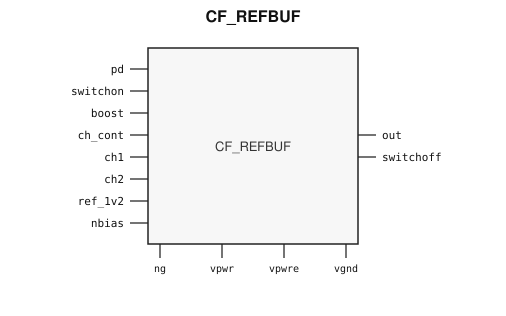
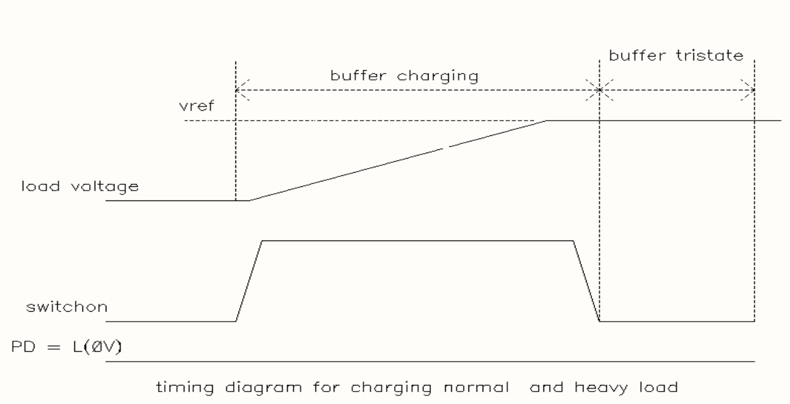

# CF_REFBUF

> Precision Reference Buffer

Draft for designer review. The public GDS is an abstract; ChipFoundry
substitutes protected full geometry at tapeout.

This package ships an SRAM-style PG wrap `CF_REFBUF` around analog leaf
`CF_REFBUF_core`.

## Overview

`CF_REFBUF` is a SkyWater 130 nm hard macro that buffers a 1.0 V or 1.2 V
reference onto an analog bus to drive capacitive loads. The buffer can be
tri-stated. A core supply (`vpwr`) and an external supply (`vpwre`) are
required, plus a boosted analog supply on `ng`.

`pd` is active-high power-down. `switchon` closes the output switch onto the
load. `out` is the tri-statable buffer output. `ref_1v2` is the reference
input. `nbias` is the bias-current input. `switchoff` is a test output.

Light and medium loads are handled by a correction amplifier. Very heavy loads
use a strong-drive path enabled by `boost`. Load feedback returns on `ch1` or
`ch2`; `ch_cont` selects the channel.

Macro size is 153.225 × 177.695 µm (15 µm halo around analog leaf
123.225 × 147.695 µm). Customer PG for chip PDN is `vpwr` / `vgnd`. Analog
rails `vpwre` and `ng` stay on the wrap. Well taps are tied inside.

## Installation

```bash
pip install cf-ipm
ipm install CF_REFBUF --version 0.2.7 --include-drafts
```

Until the marketplace listing is published, install from a local catalog
override:

```bash
ipm install CF_REFBUF --version 0.2.7 --include-drafts --local-file ip/catalog.json
```

Use `hdl/gl/CF_REFBUF.v` as the customer blackbox, `layout/lef/CF_REFBUF.lef` for
P&R, and `layout/gds/CF_REFBUF.gds` / `layout/mag/CF_REFBUF.mag` for the public
wrap. `CF_REFBUF_core` is the analog leaf (pin-only abstract). ChipFoundry
substitutes vault GDS into `CF_REFBUF_core` at tapeout. Functional sim uses
`verify/beh_model/CF_REFBUF_core.v`. `timing/lib/` is the characterized analog
view; P&R uses the wrap LEF (`vpwr` / `vgnd` plus analog `vpwre` / `ng`).

## Features

- 1.0 V / 1.2 V reference buffer for capacitive loads
- Tri-statable output `out`
- Active-high power-down `pd`
- Output switch `switchon`
- Strong-drive enable `boost`
- Load-feedback channels `ch1` / `ch2` with select `ch_cont`
- Dual supply: core `vpwr` and external `vpwre`
- Boosted analog supply input `ng`
- Customer cell `CF_REFBUF` 153.225 × 177.695 µm (15 µm halo around analog leaf 123.225 × 147.695 µm)
- Chip PDN is `vpwr` / `vgnd`. Well taps `vpb` / `vnb` / `vpbe` are tied inside the wrap.

## Pinout

Customer documentation includes a pinout of the integration cell only.
Internal schematics and architecture block diagrams are not published.



Pin names and directions match the public wrap (`layout/lef/CF_REFBUF.lef`)
and the blackbox stub (`hdl/gl/CF_REFBUF.v`).

## Pin Description

Directions and widths are taken from the shipped Verilog in `hdl/gl/CF_REFBUF.v`.
Descriptions are from the packaging extract where they match that stub.

| Name | Direction | Width | Description |
|---|---|---:|---|
| `out` | output | 1 | Tri-statable buffer output onto the load. |
| `switchoff` | output | 1 | Test-mode control output. |
| `pd` | input | 1 | Power-down, active high. `0` = buffer active; `1` = buffer disabled. |
| `switchon` | input | 1 | Output switch. `0` = open (disconnected from the load); `1` = closed. |
| `boost` | input | 1 | Active-high enable for the strong-drive path. |
| `ch_cont` | input | 1 | Feedback-channel select. `1` = `ch1`; `0` = `ch2`. |
| `ch1` | input | 1 | Feedback from the load into the strong-drive path. |
| `ch2` | input | 1 | Feedback from the load into the strong-drive path. |
| `ref_1v2` | input | 1 | 1.0 V / 1.2 V reference input. |
| `nbias` | input | 1 | Bias-current input. Source typical 9.6 µA ±5%. |
| `ng` | input | 1 | Boosted analog supply. |
| `vpwr` | input | 1 | Core supply, about 1.6–2.0 V. |
| `vpwre` | input | 1 | External supply, about 1.65–5.5 V. |
| `vgnd` | input | 1 | Ground. |

`CF_REFBUF_core` also has well taps `vpb` (core n-well), `vpbe` (HV n-well), and
`vnb` (p-substrate). The wrap ties `.vpb(vpwr)`, `.vpbe(vpwre)`, and `.vnb(vgnd)`.
Do not connect those pins at chip level.

In OpenLane / LibreLane, hook chip PDN with
`PDN_MACRO_CONNECTIONS: "u_cf_refbuf vccd1 vssd1 vpwr vgnd"` and connect
`.vpwr(vccd1)`, `.vgnd(vssd1)` under `USE_POWER_PINS`. Route analog `vpwre` and
`ng` separately. Do not list `vpb` / `vnb` / `vpbe` on the wrapper instance.

## Specifications

Headline operating range from the source extract: industrial temperature,
core supply about 1.6–2.0 V, external supply about 1.65–5.5 V, reference
1.0 V or 1.2 V. Pin capacitance, leakage, and voltage maps are in
`timing/lib/`.

## Timing Diagram

With `pd` held low, raising `switchon` charges the load toward `vref`. After
`switchon` falls, `out` tri-states and the load holds.



## Limitations and Open Issues

- Verilog in `hdl/gl/CF_REFBUF.v` is a structural wrap around
  `CF_REFBUF_core`. P&R uses the empty `hdl/gl` blackbox. Functional sim
  uses `verify/beh_model/CF_REFBUF_core.v` (ideal unity buffer, not SPICE).
- Liberty is a leakage / pin-capacitance view (no timing tables). It may still
  list leaf well taps; P&R uses the wrap LEF.
- Public wrap uses Sky130 `prBoundary` 235/4, OBS on li1/met1/met2 blockage
  datatype 10, a 2 µm-inset `dnwell` (64/18), fom/poly waffleDrop, north-halo
  met3 PG straps, full-height met4 `vpwr`/`vgnd`, and a Magic `layout/mag`
  view. Analog leaf views are `CF_REFBUF_core`.

## Tapeout History

This hard macro has high-volume commercial production history (millions of
units). Catalog and IPM maturity is Production.

This ChipFoundry SkyWater 130 nm package delivers an abstract for
integration. ChipFoundry substitutes protected full layout at tapeout.
The chipIgnite delivery of this package is not marked shuttle-proven until
a run returns.

| Version | Date | Notes |
|---|---|---|
| 0.1.0 | 2026-09-04 | First unpublished IPM draft from the chip-wrapper abstract. Four cells. No Liberty. |
| 0.1.1 | 2026-09-04 | Pin Description table on wrapper pin names. |
| 0.2.0 | 2026-09-04 | Single public cell: characterized analog core renamed to `CF_REFBUF`. Pinout matches Liberty (`switchon`, `pd`, `ref_1v2`, `ch1`/`ch2`, `boost`). Wrapper and glue cells dropped. Breaking change from 0.1.x. |
| 0.2.1 | 2026-09-04 | Magic `.mag` abstract, 2 µm dnwell keepout, interior met2 `vpwr`/`vgnd` straps for PDN. |
| 0.2.2 | 2026-09-05 | SRAM-style PG wrap: analog leaf is `CF_REFBUF_core`; customer `CF_REFBUF` exposes chip PDN `vpwr`/`vgnd` plus analog `vpwre`/`ng`. Well taps tied inside. |
| 0.2.3 | 2026-09-18 | Magic-port seed on north-PR `switchon` met2; core GDS label relocated onto that pad so precheck LVS unique-matches `analog_ctrl[105]`. |
| 0.2.4 | 2026-09-19 | Relocate wrap Magic-port labels onto vendor pads of PR stems. |
| 0.2.5 | 2026-09-20 | Ship an ideal `verify/beh_model` core (unity `ref_1v2` → `out`). |
| 0.2.6 | 2026-09-21 | Core waffleDrop, inset dnwell, li/met1/met2 blockage, and slotted dummy poly/diff for tapeout pd/f1. |
| 0.2.7 | 2026-09-25 | Core `cmm1`/`cmm2` waffleDrop (62/24, 105/52) so fillgen does not overwrite analog. LI fill-block remains `li1.blockage` 67/10. |
